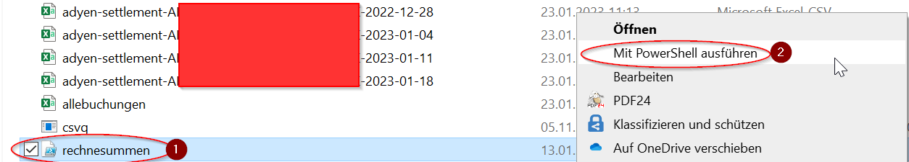

# check-settlement
Kleines Script, welches die Settlement Auszahlungen über mehrere Wochen bzw. Kontoauszüge hinweg, nachrechnet/summiert.

# Installation
Sie benötigen
* *rechnesummen.ps1*: Ein kleines Script, dass alle CSV Dateien in ihrem Verzeichnis in eine Datei *allebuchungen.csv* zusammenkopiert und mittels *csvq* Summen für alle geplanten Auszahlungen berechnet
* *csvq.exe* Ein kleines Open Source Tool von [mithrandie](https://github.com/mithrandie) um CSV Daten auszuwerten. Sie können es entweder von [Github](https://mithrandie.github.io/csvq/) laden oder Version v1.17.11 mitsamt dem Script von diesen Releases downloaden.

# Download 

[Release v1 16.0.2023](https://github.com/shoepping-merchants-tools/check-settlement/raw/main/releases/1/rechnesummen.zip)

# Benutzung

* Legen Sie ein eigenes Verzeichnis für die Kontoauszüge / Settlementfiles an und legen dort *rechnesumme.ps1* und *csvq.exe* ab.
* Kopieren Sie alle Settlement CSV Dateien, die Sie erhalten haben bzw. die Sie prüfen möchten in dieses Verzeichnis,  in dem auch *rechnesumme.ps1* und *csvq.exe* abgelegt wurde.
* Öffnen Sie das Verzeichnis im Explorer
* Klicken Sie mit der rechten Maustaste auf *rechnesumme.ps1* (1) und wählen Sie *mit PowerShell ausführen* (2)

